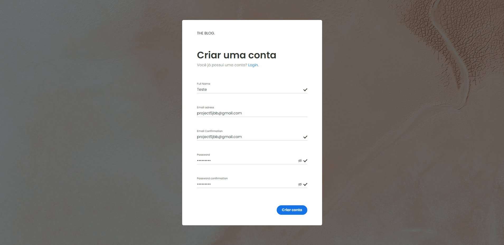

<h1>The Blog Social Media</h1>

<h4 align="center">
  Responsive Mobile navigation preview:
  
</h4>

<h4 align="center">
  Register account preview:
  
</h4>

<h4 align="center">
  Create post preview:
  
</h4>

You can check all of the screens and gifs with previews by clicking [here](https://github.com/muhhx/TheBlog-Frontend/tree/main/preview)

## About this Project
- **Live website:** <https://theblogsocial.herokuapp.com/>
- **Server API repository:** <https://github.com/muhhx/TheBlog-Backend/>
  
The idea of the app was to create a social media similar to Medium, where you can create, share, and interact with blog posts from other users.

The social media is completely functional, including Authentication, integration with third-party services and with many more functionalities that enhance the user experience (I've actually put a lot of effort in making a good user experiences in all of the pages, with loading status for API calls, etc.)

Let's connect on LinkedIn: <https://www.linkedin.com/in/muhhx/>

Send me an email: muriloue@gmail.com

## Important Observations
- The mailing service may take some time to send you a confirmation email so you can log into the app, so I recommend registering with Google OAuth.
- In future updates, I will be including two main features. The first one is adding tags to blog posts; users will also be able to select what tags they like, so the algorithm can recommend posts with tags similar to what the user choose. The second functionality will be a searching option, where the user can search through posts, tags and other users.

## Built with (client)
- [Typescript](https://www.typescriptlang.org/) | More transparency and control over the code
- [React](https://reactjs.org/docs/getting-started.html) | React functional components
- [React-Router-Dom v6](https://reactrouter.com/docs/en/v6/getting-started/overview) | Router
- [React Context API](https://reactjs.org/docs/context.html) | Manage simple states
- [React-Loader-Spinner](https://www.npmjs.com/package/react-loader-spinner) | Simple library for the UI Spinner component
- [Redux Toolkit](https://redux-toolkit.js.org/) | Main state manager
- [Redux Thunk](https://redux.js.org/usage/writing-logic-thunks) | Handle state change due to async code
- [CSS Modules](https://developer.mozilla.org/en-US/docs/Web/CSS) | Styling the blog posts
- [Styled-Components](https://styled-components.com/) | Styling
- [Axios](https://axios-http.com/docs/intro) | HTTP requests
- [Axios (Interceptors)](https://axios-http.com/docs/interceptors) | 403 handler for expired Access Tokens, generating new ones through the Refresh Token route
- [react-markdown](https://www.npmjs.com/package/react-markdown) | Markdown for blog posts
- [remark-gfm](https://www.npmjs.com/package/remark-gfm) | Markdown plugin

## Support tools
- [Google OAuth](https://developers.google.com/identity/protocols/oauth2) | Google Oauth for Authentication
- [JWT Tokens](https://jwt.io/) | Accesss and Refresh tokens for Auth, stored in httpOnly Cookie

***Note:** more tools and technologies were used in the server API for this application, where you can check it [here](https://github.com/muhhx/TheBlog-Backend)*

## Functionality guide
- Navigate through the blog posts in the discover page (infinite scrolling functionality), find the one you are interested the most, interact with (comment, upvote) it and save it to your list of favorites. Maybe follow the Author of the post if you want!
- Create your own blog posts and share with the community!
- Responsive interface for all screens
- Discover other people's posts in the Discover page
- Discover new posts from people that you follow in the For you page
- Authentication, Email confirmation and Forgot password
  - Create or log into your account using Google OAuth (we will access your name, email and verifiedEmail information from your Google account)
  - Create an account with real time password, name and email validation
  - Login into your account with JWT access and refresh tokens
  - Confirm your email by clicking on the link sent to your email by our mailing services!
  - If you dont recieve the email, you can submit it again in the "Confirm email" option on the login page
  - Forgot your password? No problem! Inform your email in the forgot password page (available in the login page), and we will send you and email where you will be redirected to a page so you can create a new password.
- User data
  - Update your uesr information
  - Change your password
  - Delete your account (when you delete it, your posts and comments will stil be in the app; however, they will not show your information as the author, but a "Deleted User" info instead)
- User Profile Page
  - Check your published posts (delete them if you want)
  - Check your list of favorite posts
  - Edit your profile
  - Check the number of followers and people who you are following!
- Interact with other posts
  - Upvote posts
  - Remove your upvote
  - Save the post to your favorites list
  - Remove the post from your favorites list
  - Comment on the post
  - Remove your comment
  - Update your comment
  - Check other peoples profile by clicking in their names (author of the post or author of the comments)
- Create a post
  - Use our creation panel to create a new post using Markdown
  - You can choose between three screens
    1. **Editor:** write your posts
    2. **Preview:** preview how your markdown is being "printed"
    3. **Real time:** write your post down and also preview how it is being printed out at the same time
  - After the post is done, you can add a image link, summary that will be displayed at the discover or for you page.

<h4 align="center">Murilo Santos, 2022.✨™</h4>